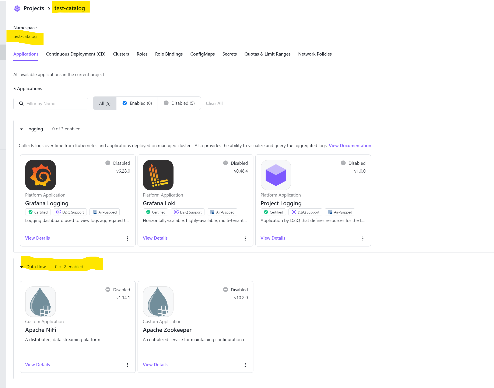

# dkp-dataflow-applications

- In the UI, create a project called test-catalog, ensure that the default namespace is not used, used test-catalog.
  
- Set your context to the management cluster.
  
- Apply the deploy manifest
  
    ```bash
    kubectl apply -f deploy.yaml
    ```

<p align="center">

</p>